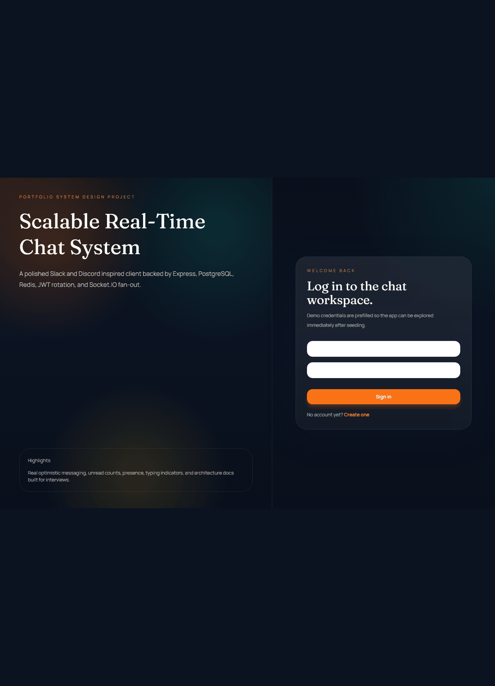
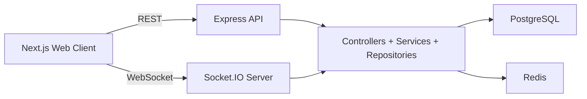
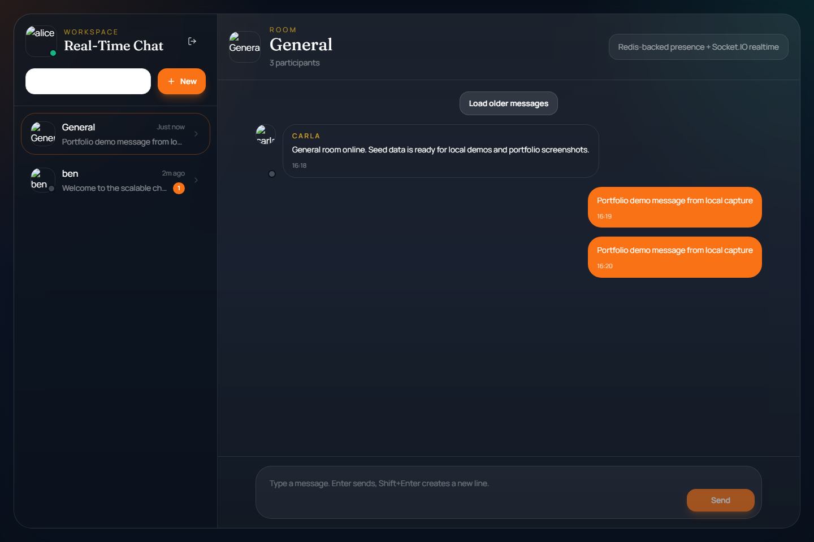
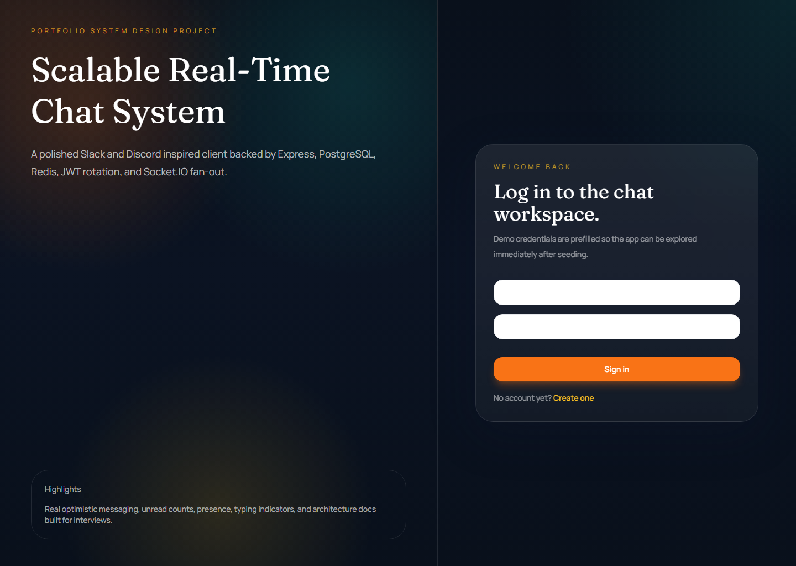
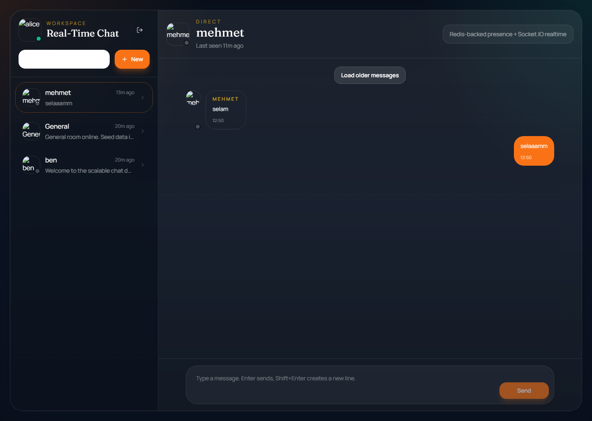
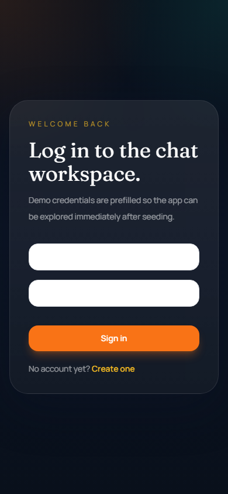

# Scalable Real-Time Chat System


Production-style full-stack chat platform that demonstrates how to build a real product and explain its architecture like an engineer, not just ship a demo.

## Why I Built This

Most chat portfolio projects stop at "messages appear in real time." That is not the interesting engineering problem.

I built this project to show how a serious chat system is structured when realtime delivery, auth, unread state, presence, pagination, and horizontal scaling all start to matter at the same time.

The goal was to build something that is:

- product-shaped enough to demo,
- backend-heavy enough to discuss in interviews,
- honest about tradeoffs,
- organized like a codebase that could evolve beyond a toy project.

## Product Snapshot

- JWT auth with refresh token rotation
- direct messages and group rooms
- realtime messaging with Socket.IO
- Redis-backed presence and typing indicators
- unread counts and paginated message history
- optimistic UI updates
- Swagger API docs
- Docker-based local infrastructure
- integration tests for key API flows

## Demo



- Video placeholder: [`docs/videos/demo.mp4`](./docs/videos/demo.mp4)

### Suggested Walkthrough

1. Sign in with a seeded demo account.
2. Open the main workspace and switch between conversations.
3. Send a message and watch optimistic UI plus realtime delivery.
4. Open the same room in another browser session to show presence and typing.
5. Show Swagger docs and explain the API plus websocket split.

### Demo Assets

- Screenshots live in [`docs/screenshots`](./docs/screenshots/README.md)
- Video capture notes live in [`docs/videos`](./docs/videos/README.md)

## Architecture At A Glance



## Monorepo Structure

```text
.
|-- apps
|   |-- api        # Express API, Prisma, Socket.IO, tests
|   `-- web        # Next.js frontend, Tailwind UI, auth/chat UX
|-- packages
|   `-- shared     # Shared schemas, DTOs, contracts, types
`-- docs           # System design, scaling, security, tradeoffs
```

## Tech Stack

| Layer | Stack |
| --- | --- |
| Frontend | Next.js, TypeScript, Tailwind CSS, React Query, Socket.IO Client |
| Backend | Node.js, Express, TypeScript, Socket.IO |
| Data | PostgreSQL, Prisma ORM |
| Realtime Support | Redis, Socket.IO Redis adapter |
| Auth | JWT access token + refresh token rotation |
| Tooling | Docker Compose, ESLint, Prettier, Vitest, Supertest |

## What It Demonstrates

- building REST and websocket flows in the same product
- choosing relational data modeling for conversations, memberships, and tokens
- separating durable state from ephemeral state
- thinking about multi-instance scaling before the system is split into services
- writing supporting docs that explain why the architecture looks the way it does

## Core Features

### Authentication

- register
- login
- refresh token rotation
- logout
- protected routes

### Profiles and Presence

- username and avatar placeholder
- online or offline indicator
- last seen timestamp
- room join and leave awareness

### Chat System

- one-to-one direct conversations
- group channels or rooms
- realtime delivery
- typing indicator
- unread message counts
- timestamps and paginated history
- optimistic frontend sends

## Scaling Decisions

### 1. Modular Monolith First

This system is intentionally built as a modular monolith instead of microservices.

Why:

- lower operational complexity,
- faster development and iteration,
- easier local setup,
- better fit for a single-developer portfolio project.

Scaling path:

- keep clean domain boundaries now,
- add multiple API nodes behind a load balancer later,
- use Redis to share websocket fan-out and presence state,
- extract services only when the operational cost becomes justified.

### 2. PostgreSQL For Durable State

I chose PostgreSQL because users, tokens, conversations, participants, and messages are strongly related entities with consistency requirements.

That makes relational constraints, indexes, and transactional writes more valuable than document flexibility at this stage.

### 3. Redis For Shared Ephemeral State

Redis is used where short-lived cross-node state matters:

- presence counters,
- typing TTL keys,
- websocket fan-out through the Socket.IO Redis adapter.

This keeps the database focused on durable records while Redis handles fast-changing coordination data.

### 4. Socket.IO Instead Of Raw WebSockets

Socket.IO adds protocol overhead, but the trade is worth it here because rooms, acknowledgements, reconnection handling, and Redis adapter support all arrive with less custom infrastructure.

## Tradeoffs

### Chosen: richer architecture, but not maximum complexity

I deliberately stopped short of event sourcing, CQRS projections, message brokers, or microservices. Those patterns can be valid at large scale, but adding them too early would make the repository look less honest and harder to reason about.

### Chosen: HTTP plus WebSockets

HTTP handles initial fetches and paginated history well. WebSockets handle active conversation updates well. Combining both is more complex than pure request-response, but it gives a much more realistic product shape.

### Chosen: Redis plus PostgreSQL

This adds another moving part, but it cleanly separates:

- durable business state in PostgreSQL,
- shared ephemeral state in Redis.

That separation is one of the most important design ideas in the project.

## Screenshots



Available captures:





## Quick Start

### 1. Install dependencies

```bash
npm install
```

### 2. Start infrastructure

```bash
docker compose up -d postgres redis
```

### 3. Copy environment files

PowerShell:

```powershell
Copy-Item apps/api/.env.example apps/api/.env
Copy-Item apps/web/.env.example apps/web/.env.local
```

### 4. Generate Prisma client and run migrations

```bash
npm run db:generate
npm run db:migrate
```

### 5. Seed sample data

```bash
npm run db:seed
```

### 6. Run in development

```bash
npm run dev
```

Frontend: `http://localhost:3000`  
API: `http://localhost:4000`  
Swagger: `http://localhost:4000/api/docs`

## Demo Credentials

- `alice@example.com` / `Password123!`
- `ben@example.com` / `Password123!`
- `carla@example.com` / `Password123!`

## API Summary

### Auth

- `POST /api/v1/auth/register`
- `POST /api/v1/auth/login`
- `POST /api/v1/auth/refresh`
- `POST /api/v1/auth/logout`

### Users

- `GET /api/v1/users/me`
- `GET /api/v1/users`

### Conversations

- `GET /api/v1/conversations`
- `POST /api/v1/conversations/direct`
- `POST /api/v1/conversations/group`
- `GET /api/v1/conversations/:conversationId/messages`
- `POST /api/v1/conversations/:conversationId/messages`
- `POST /api/v1/conversations/:conversationId/read`

### Health

- `GET /api/v1/health`

## Supporting Docs

- [Overview](./docs/overview.md)
- [Requirements](./docs/requirements.md)
- [Architecture](./docs/architecture.md)
- [Database Design](./docs/database-design.md)
- [Scaling](./docs/scaling.md)
- [Security](./docs/security.md)
- [Interview Questions](./docs/interview-questions.md)
- [Tradeoffs](./docs/tradeoffs.md)
- [Future Improvements](./docs/future-improvements.md)
- [Program Walkthrough](./PROGRAM.md)

## Interview Narrative

Short version:

> I built this to show that I can design a realtime product as a system, not just as a UI. PostgreSQL holds durable chat state, Redis coordinates ephemeral presence and cross-node websocket fan-out, and the codebase stays modular enough to scale before service extraction becomes necessary.
