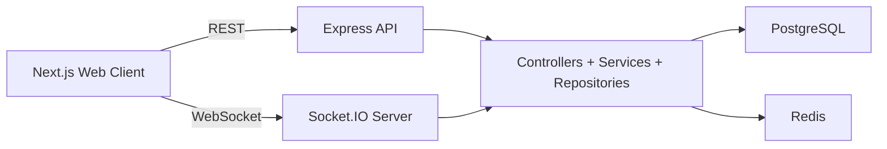
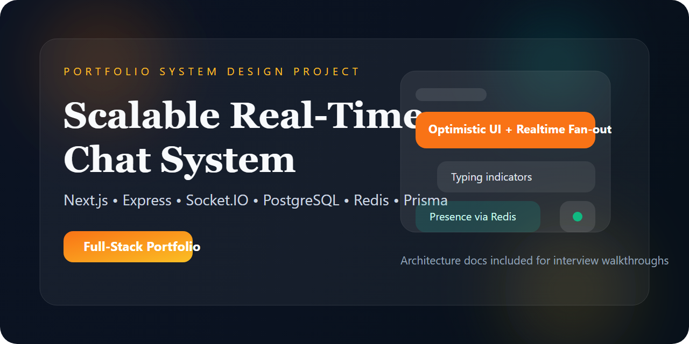

# Scalable Real-Time Chat System


Production-style full-stack chat platform built as a portfolio project inspired by the documentation depth of `system-design-primer`, but backed by a real working application.

## Why This Project
This repository is designed to look like the work of an engineer who can both build software and explain architecture decisions clearly.

It combines:
- a real Next.js + Express + Socket.IO application,
- production-oriented backend layering,
- PostgreSQL and Redis integration,
- architecture documents with Mermaid diagrams,
- interview-ready tradeoffs and scaling discussions.

## Product Snapshot
- JWT auth with refresh token rotation
- direct messages and group rooms
- real-time messaging via Socket.IO
- Redis-backed presence and typing state
- unread counts and paginated message history
- optimistic UI updates
- Swagger API docs
- Docker-based local infrastructure
- integration tests for key API flows

## Architecture At A Glance


## Monorepo Structure
```text
.
|-- apps
|   |-- api        # Express API, Prisma, Socket.IO, tests
|   `-- web        # Next.js frontend, Tailwind UI, auth/chat UX
|-- packages
|   `-- shared     # Shared schemas, DTOs, contracts, types
`-- docs           # System design, scaling, security, tradeoffs
```

## Tech Stack
| Layer | Stack |
| --- | --- |
| Frontend | Next.js, TypeScript, Tailwind CSS, React Query, Socket.IO Client |
| Backend | Node.js, Express, TypeScript, Socket.IO |
| Data | PostgreSQL, Prisma ORM |
| Realtime Support | Redis, Socket.IO Redis adapter |
| Auth | JWT access token + refresh token rotation |
| Tooling | Docker Compose, ESLint, Prettier, Vitest, Supertest |

## Screenshots
Place screenshots under [`docs/screenshots`](./docs/screenshots/README.md).

Suggested captures:
- login page,
- main chat workspace,
- mobile responsive view,
- Swagger API docs.

### Social Preview
Use `docs/screenshots/social-preview.png` as the repository social preview image in GitHub settings.



### App Screenshots


## Core Features
### Authentication
- register
- login
- refresh token rotation
- logout
- protected routes

### Profiles and Presence
- username and avatar placeholder
- online or offline indicator
- last seen timestamp
- room join and leave awareness

### Chat System
- one-to-one direct conversations
- group channels or rooms
- real-time delivery
- typing indicator
- unread message counts
- timestamps and paginated history
- optimistic frontend sends

## Design Decisions
### Modular Monolith First
The backend is intentionally a modular monolith:
- easier to reason about,
- faster to ship,
- lower operational complexity,
- still structured so services can be extracted later.

### PostgreSQL Over MongoDB
This project favors relational consistency because users, participants, conversations, refresh tokens, and messages are tightly connected.

### Socket.IO Over Raw WebSockets
Socket.IO gives rooms, reconnection handling, acknowledgements, and Redis adapter support with lower implementation cost for this project stage.

### Redis As Shared Ephemeral State
Redis is used for:
- presence counters,
- last-seen caching,
- typing TTL state,
- multi-instance websocket fan-out readiness.

## Docs
- [Overview](./docs/overview.md)
- [Requirements](./docs/requirements.md)
- [Architecture](./docs/architecture.md)
- [Database Design](./docs/database-design.md)
- [Scaling](./docs/scaling.md)
- [Security](./docs/security.md)
- [Interview Questions](./docs/interview-questions.md)
- [Tradeoffs](./docs/tradeoffs.md)
- [Future Improvements](./docs/future-improvements.md)
- [Program Walkthrough](./PROGRAM.md)

## Quick Start
### 1. Install dependencies
```bash
npm install
```

### 2. Start infrastructure
```bash
docker compose up -d postgres redis
```

### 3. Copy environment files
PowerShell:

```powershell
Copy-Item apps/api/.env.example apps/api/.env
Copy-Item apps/web/.env.example apps/web/.env.local
```

### 4. Generate Prisma client and run migrations
```bash
npm run db:generate
npm run db:migrate
```

### 5. Seed sample data
```bash
npm run db:seed
```

### 6. Run in development
```bash
npm run dev
```

Frontend: `http://localhost:3000`  
API: `http://localhost:4000`  
Swagger: `http://localhost:4000/api/docs`

## Production Mode
```bash
npm run build
npm run start -w @chat/api
npm run start -w @chat/web
```

## Demo Credentials
- `alice@example.com` / `Password123!`
- `ben@example.com` / `Password123!`
- `carla@example.com` / `Password123!`

## API Summary
### Auth
- `POST /api/v1/auth/register`
- `POST /api/v1/auth/login`
- `POST /api/v1/auth/refresh`
- `POST /api/v1/auth/logout`

### Users
- `GET /api/v1/users/me`
- `GET /api/v1/users`

### Conversations
- `GET /api/v1/conversations`
- `POST /api/v1/conversations/direct`
- `POST /api/v1/conversations/group`
- `GET /api/v1/conversations/:conversationId/messages`
- `POST /api/v1/conversations/:conversationId/messages`
- `POST /api/v1/conversations/:conversationId/read`

### Health
- `GET /api/v1/health`

## Scaling Direction
This repository is intentionally strong at the "first serious production design" stage:
- one deployable API,
- clear internal service boundaries,
- Redis-backed websocket scaling path,
- relational schema with practical indexes,
- explicit room for queues, replicas, and service extraction later.

If traffic grows significantly, the next investments would be:
- denormalized unread counters,
- async event processing,
- read replicas,
- attachment infrastructure,
- search indexing,
- dedicated messaging and presence services.

## Interview Talking Points
- why a modular monolith is the right starting point,
- how websocket scaling works with Redis adapter,
- how optimistic sends are safely reconciled using `clientId`,
- why unread counts are correct but not yet denormalized,
- why presence belongs in Redis instead of memory only,
- how the architecture would evolve at 10x or 100x scale.

## Quality Checks
```bash
npm run build
npm run lint
npm test
```

## Repository Notes
- `packages/shared` prevents frontend/backend contract drift.
- `docs/` is as important as the code for interview value.
- the project is optimized to be demoable locally and discussable in system design interviews.
