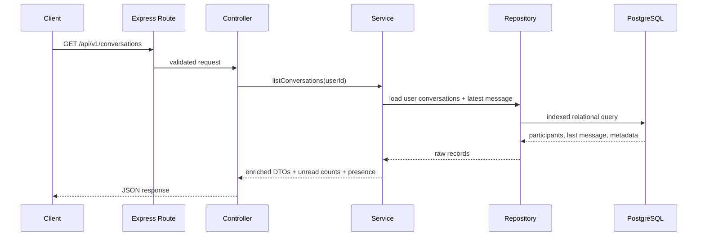
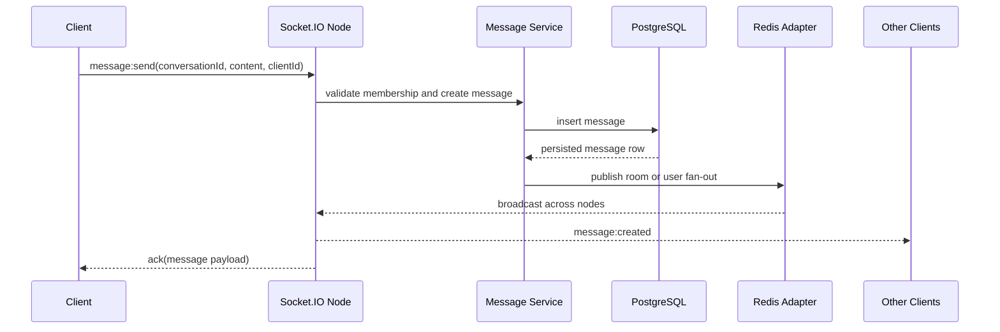

# Architecture

## High-Level Architecture
The system is split into three runtime concerns inside one backend process:

- HTTP API layer for auth, profiles, conversation creation, history fetches, and health checks.
- Websocket layer for realtime sends, typing, room joins, and presence fan-out.
- Persistence and state layer using PostgreSQL for durable data and Redis for shared ephemeral state.

This is a modular monolith with boundaries that are explicit in code:

- `routes` define surface area,
- `controllers` map transport concerns to use cases,
- `services` own business logic,
- `repositories` isolate Prisma access,
- `middlewares` handle auth, validation, and errors,
- `sockets` handle connection lifecycle and realtime event wiring.

## Request Flow

## Websocket Flow

## Database and Redis Roles
### PostgreSQL
- source of truth for users, conversations, participants, messages, and refresh tokens,
- supports relational integrity,
- supports indexed pagination for message history,
- supports consistent unread-count computations.

### Redis
- shared presence counters across backend instances,
- last-seen and typing TTL state,
- Socket.IO adapter pub-sub for horizontal websocket scaling,
- temporary state that should not live only in one process.

## Why HTTP and Websocket Both Exist
- HTTP is better for initial page data, auth endpoints, pagination, and idempotent resource access.
- Websocket is better for low-latency fan-out, typing signals, and room presence.
- Mixing both gives a cleaner system than forcing everything through one transport.

## Tradeoffs in the Current Design
- Unread counts are computed simply and correctly, but can become expensive at very large scale without denormalized counters.
- Timestamp-based message pagination is easy to explain, but cursor pagination based on message IDs or snowflake-style IDs would be stronger for very high throughput.
- A single API process is easier to operate now, but it couples realtime and REST deployment cadence.

## Failure Modes Considered
- Access token expiration during active usage is handled through refresh token rotation.
- Multiple websocket nodes require the Redis adapter so events are not trapped on one node.
- Presence state survives node distribution but not Redis outages. During Redis degradation, durable chat still exists, but presence becomes less reliable.
- If PostgreSQL is unavailable, message persistence should fail fast rather than silently dropping events.
