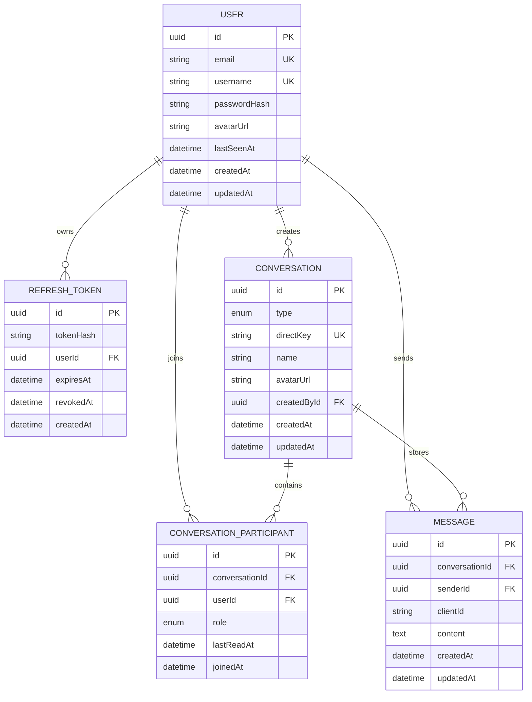

# Database Design

## Data Model Goals
- Keep message history durable and queryable.
- Support both direct and group conversations with one normalized model.
- Preserve room membership and unread state per user.
- Keep refresh token revocation auditable.

## ER Diagram

## Table Explanations
### `User`
- Stores identity, login fields, avatar placeholder, and last seen timestamp.
- `email` and `username` are unique because both can be search handles in the UI.

### `RefreshToken`
- Stores hashed refresh tokens for revocation and rotation.
- Keeps session management state out of access tokens.
- A dedicated table allows invalidation on logout and eventual device session views.

### `Conversation`
- Represents both direct and group conversations.
- `type` distinguishes direct versus group behavior.
- `directKey` gives direct messages a deterministic unique identifier so duplicate one-to-one threads are avoided.

### `ConversationParticipant`
- Resolves the many-to-many relationship between users and conversations.
- Stores role and `lastReadAt`, which is enough for basic unread calculations.
- Keeps membership data normalized rather than embedding user arrays directly in conversations.

### `Message`
- Stores durable text messages.
- `clientId` enables optimistic UI deduplication.
- Messages belong to one conversation and one sender.

## Indexing Strategy
- `Message(conversationId, createdAt DESC)` for history pagination.
- `Message(senderId, createdAt DESC)` for sender-centric debugging or future profile timelines.
- `Conversation(type, updatedAt DESC)` to sort rooms and direct threads quickly.
- `ConversationParticipant(conversationId, userId)` unique key to prevent duplicate membership rows.
- `ConversationParticipant(userId, joinedAt DESC)` to load a user’s rooms efficiently.
- `RefreshToken(userId, expiresAt)` for revocation and cleanup tasks.

## Pagination Strategy
Message history uses cursor pagination based on `createdAt`:

- fetch latest messages ordered descending from the database,
- reverse them before returning so the UI displays oldest-to-newest inside each page,
- use the oldest timestamp in the page as `nextCursor`,
- request older slices using `createdAt < cursor`.

This is simple and index-friendly. At much larger scale, the cursor would usually move to a unique monotonic message ID to avoid timestamp collision edge cases.

## Why PostgreSQL Fits This Version
- strong relational integrity,
- straightforward joins for participants and messages,
- predictable indexing strategies,
- easier unread-count logic than a document-first model,
- clean future path to partitioning and read replicas.
