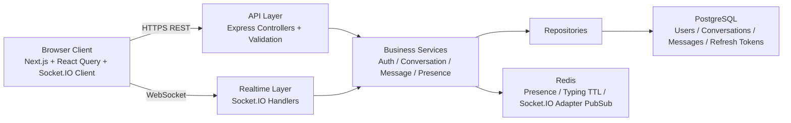

# Scalable Real-Time Chat System

## What This Project Is
Scalable Real-Time Chat System is a portfolio-grade monorepo that combines:

- a working full-stack chat application,
- production-style backend layering,
- real-time messaging with Socket.IO,
- Redis-backed presence and temporary state,
- PostgreSQL persistence with Prisma,
- architecture documentation written for interviews.

The goal is not to clone Slack or Discord feature-for-feature. The goal is to demonstrate how an engineer can build a credible simplified messaging platform while explaining the scaling implications and tradeoffs clearly.

## Goals
- Show clean separation between HTTP APIs, websocket handling, business logic, and persistence.
- Demonstrate pragmatic system design choices for a modular monolith that can evolve into distributed services later.
- Keep the application usable locally with Docker Compose, seed data, and clear setup scripts.
- Make the repo easy to discuss in interviews by pairing working code with explicit architecture reasoning.

## Architecture Summary
- `apps/web`: Next.js client with login, register, sidebar, thread view, optimistic sends, and live presence updates.
- `apps/api`: Express API, Socket.IO server, Prisma data access, JWT auth, refresh token rotation, and Redis integrations.
- `packages/shared`: shared zod schemas, contracts, DTOs, and common types used by both apps.
- `docs`: design docs, tradeoffs, scaling notes, and interview questions.

## Why This Architecture
This codebase intentionally starts as a modular monolith:

- simpler to run locally,
- easier to reason about in a portfolio context,
- fast to iterate on,
- still structured so services can be extracted later.

That means the repo keeps a single deployable API process for HTTP plus websocket traffic, but already separates concerns internally through controllers, services, repositories, middlewares, and socket handlers.

## High-Level Diagram

## What Makes It Interview-Ready
- Explicit non-functional requirements and scale assumptions.
- Documented tradeoffs like PostgreSQL vs MongoDB and Socket.IO vs raw WebSocket.
- Clear upgrade path from one instance to horizontally scaled websocket nodes.
- Code that matches the docs instead of aspirational diagrams disconnected from implementation.
