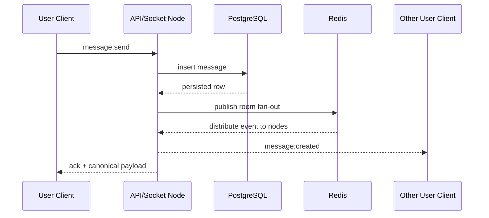

# Scaling

## Horizontal Scaling
The first scaling step is running multiple API nodes behind a load balancer:

- each node serves REST and websocket traffic,
- PostgreSQL remains the primary durable store,
- Redis becomes shared infrastructure for websocket fan-out and presence state,
- sticky sessions are not required if websocket authentication is token-based and the Redis adapter is enabled.

## Load Balancer Usage
- Terminate TLS at the edge or at the ingress proxy.
- Route HTTP traffic normally across nodes.
- Support websocket upgrade requests for Socket.IO.
- Apply connection draining during deployments so active websocket sessions reconnect cleanly.

## Websocket Scaling with Redis Adapter
Socket.IO rooms are local to a node by default. That becomes a problem once users connected to the same room land on different nodes.

The Redis adapter fixes that by:

- publishing events across nodes,
- synchronizing room broadcasts,
- letting one node emit while another node owns the recipient socket.

This is the current project’s main horizontal-scaling mechanism for realtime delivery.

## Presence Scaling
Presence cannot rely on in-memory process state once multiple nodes exist.

Current strategy:

- store a per-user connection count in Redis,
- mark user online when count is greater than zero,
- update last seen when count reaches zero,
- store typing keys with TTL so stale typing state expires automatically.

This is a strong pragmatic solution for mid-scale systems.

## Read Replicas
As read traffic grows, conversation list and history fetches can overwhelm the primary if every request hits the write node.

Future scaling path:

- primary PostgreSQL handles writes,
- read replicas serve conversation list and older history reads,
- replica lag must be considered for immediately-after-send history fetches.

Realtime fan-out still comes from websocket events, so minor replica lag is often acceptable for history reads.

## Sharding Ideas
At very large scale, database partitioning becomes relevant.

Possible sharding keys:

- shard conversations by conversation ID,
- shard users by user ID for profile and session domains,
- split hot messaging data from colder identity data.

The cleanest evolution would usually be:

1. partition or shard message tables first,
2. keep identity and auth data centralized longer,
3. extract messaging and presence into dedicated services only when operational complexity is justified.

## Caching Strategy
- Redis already caches presence and typing.
- Conversation summaries could be cached for hot users if read load grows.
- User profile lookups could be cached briefly because presence is the only rapidly changing dimension.
- Message history is usually not worth aggressive global caching because access patterns are conversation-specific and freshness-sensitive.

## CDN for Static Assets
This version only uses avatar placeholders, but a real system with uploads should:

- store files in object storage,
- serve them through a CDN,
- keep binary attachment traffic away from app nodes and the database.

## Message Queue Discussion
The current version emits directly after persistence. At much larger scale, a queue or event log becomes useful:

- message persisted,
- event published to a broker,
- downstream workers handle notifications, analytics, indexing, search, and delivery fan-out.

Candidate future brokers:

- Kafka for high-throughput ordered streams,
- RabbitMQ for flexible worker routing,
- cloud-native queues for operational simplicity.

## Sequence Diagram for Sending a Message

## What Would Be Needed for Millions of Users
- dedicated auth, messaging, and presence services,
- message IDs optimized for ordering and partitioning,
- asynchronous event processing pipeline,
- message storage partitioning or sharding,
- read replicas plus region-aware routing,
- object storage plus CDN for attachments,
- observability stack for socket connection counts, queue lag, Redis saturation, and PostgreSQL hotspots,
- richer backpressure and rate-limiting controls.
